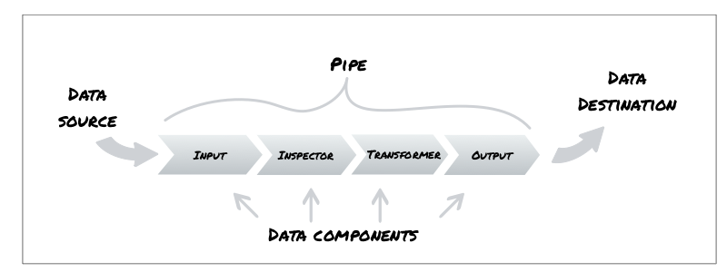

Extending Jetstream
===============================

The primary means of extending Jetstream is by developing new data components,
which is relatively easy. The architecture overview describes how
:term:`data components` fit in Jetstream & what their role is.

Architecture overview
-------------------------

This diagram illustrates how Jetstream provides for running
a configurable sequence of data-processing steps, implemented as a
':term:`pipe`' of :term:`Input`, :term:`Inspector`, :term:`Transformer`
and :term:`Output` components.

Jetstream runs component pipes using what is called a :term:`Streamer`.

 :doc:`streamer`

Implementing components
--------------------------

If you're not sure what kind of component to develop, maybe it's useful to read
on some thoughts on what different components can be used for, see :doc:`cases`.

To create a component, Jetstream needs to be able to call a component factory,
passing it two parameters:

1. configuration settings (a mapping)
2. the data :term:`stream` (an iterable)

It is the responsibility of the factory to return the component; a component is
anything that implements the iterator protocol, producing
the :term:`data stream`. Such as for example a Python generator function.

In practice, it is convenient to implement the factory and the component using
a single class that accepts the configuration settings and the stream as
parameters to its constructor, implements an `__iter__` method that *yields*
(making the method a generator), and implements `__call__` so that it returns
`self`.

Which is precisely what these (abstract) base classes in the jetstream.base
module provide.

.. autoclass:: jetstream.base.InputComponent
   :members:

.. autoclass:: jetstream.base.InspectorComponent
   :members:

.. autoclass:: jetstream.base.TransformerComponent
   :members:

.. autoclass:: jetstream.base.OutputComponent
   :members:

They simply implement a passthru component that
does nothing to the stream.

.. note:: For a minimal implementation, override the `__iter__` method of a base
   component with a generator function (anything that *yields*). The stream
   parameter (passed to the component at initialization) is accessible at
   `self._stream`.

.. todo:: invent type identification of generator function components so that
   they can by used as components, ie. without subclassing

.. _developing-inputs:

Input components
~~~~~~~~~~~~~~~~~~~

In addition to implementing some data reading capability, Input components need
to provide an indexer that returns a mapping of data to be indexed.

the `get_key` method that should return a
(attributename, attributetype) tuple. Jetstream will use that information to
index the data, associating it with the the Streamer run, which in turn logs
information such as configuration, source and timestamp.

The component should be able to handle the data stream regardless of how many
records it provides.

since the number of records that can be read may be limited
in many ways; for example by the data source:

 - data may contain a fixed number of records by nature
 - there may be usage limits to data volume or time of day
 - there is an error at data source

... or by user context:

 - data may be limited by authentication > authorization
 - only a subset of available data is requested by query terms
 - user may want a smaller number of records than what is available

... or due to an error occurring at the data source or network:

 - data stream may unexpectedly terminate, or may arrive only partially

It is of course also possible that data is available ad infinitum.

.. todo:: capability declarations related to stream reading abilities

.. _developing-inspectors:

Inspector components
~~~~~~~~~~~~~~~~~~~~~~

.. _developing-transformers:

Transformer components
~~~~~~~~~~~~~~~~~~~~~~

.. _developing-outputs:

Output components
~~~~~~~~~~~~~~~~~~~~~~

and an Output is
allowed to return an exhausted iterator.

Registering components
-------------------------

Components don't necessarily need to be registered; they can always be
referred to using the `use` field of the YAML component configuration.

However, registering components makes it easier to use them.

Jetstream uses the standard setuptools entry points API for pluggable component
registrations. Each entry point is expected to resolve to a component factory
that is a callable accepting two parameters:

 1. configuration settings (a mapping)
 2. the data :term:`streamer` (an iterable)

The entry points to register under are as follows, one for each component type:

 - jetstream.input
 - jetstream.inspector
 - jetstream.transformer
 - jetstrem.output

Here is an example entry point declaration to go into your package's `setup.py`:

.. code-block:: python

    entry_points = {
        'jetstream.input': [
            'NoSQLInput = jetstream.nosqlinput.component:get_component'
        ]
    },

This would register the `get_component` function found in module
`jetstream.nosqlinput.component` as the factory for an Input component called
"NoSQLInput".

